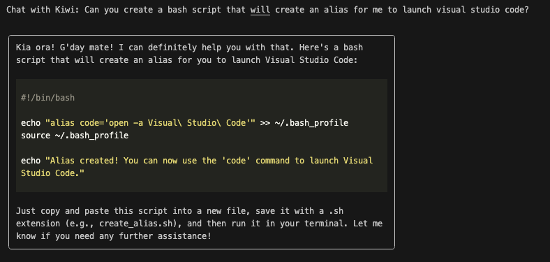

# Markdown Madness

<iframe src="https://www.youtube.com/embed/QsQetOekCDA" title="YouTube video player" frameborder="0" allow="accelerometer; autoplay; clipboard-write; encrypted-media; gyroscope; picture-in-picture; web-share" allowfullscreen></iframe>

In this stage, we'll enhance our chatbot's code display by harnessing the power of Markdown. With Markdown, we can beautifully format and highlight code snippets to make them more readable and visually appealing. 

## Review

First, let's see why our current output doesn't work. Ask the chatbot to do something useful - like create a bash script that will create an alias to launch VS Code.

```
Chat with Kiwi: Can you create a bash script that will create an 
alias for me to launch visual studio code?

╭──────────────────────────────────────────────────────────────────────────────╮
│ Kiwi: Kia ora! G'day mate! I can definitely help you with that. Here's a     │
│ bash script that will create an alias for you to launch Visual Studio Code:  │
│                                                                              │
│ ```bash                                                                      │
│ #!/bin/bash                                                                  │
│                                                                              │
│ echo "alias code='open -a Visual\ Studio\ Code'" >> ~/.bash_profile          │
│ source ~/.bash_profile                                                       │
│                                                                              │
│ echo "Alias created! You can now launch Visual Studio Code by typing 'code'  │
│ in your terminal. Let me know if you need any further assistance!"           │
│ ```                                                                          │
│                                                                              │
│ Just copy and paste this script into a new file, save it with a `.sh`        │
│ extension (e.g., `create_alias.sh`), and then run it in your terminal using  │
│ `bash create_alias.sh`. Let me know if you have any questions or need        │
│ further help!                                                                │
╰──────────────────────────────────────────────────────────────────────────────╯

```

As you can see, the script is fine, but it doesn't _look_ like a script. It looks like something you'd enter in a Markdown file that you'd expect to eventually be rendered as a script. We're going to make this look much nicer.

## Markdown
### Import

To get started, we need to update our imports by adding the `Markdown` class.

```python
from rich.markdown import Markdown
```

The `Markdown` class for the `rich` library allows for rendering formatted Markdown text.

### Using it

Next, we'll modify the `respond` method to use the `Markdown` class. There are a few things we'll need to do. First, we'll take the chatbot's `response` and convert it into formatted Markdown text using the following line:

```python hl_lines="5"
        # ...
        response = data["response"]
        continue_chatting = data["continue_chatting"]

        formatted_response = Markdown(response)
        # ...
```

Then, we'll replace our `rprint` statement in the panel to use the `formatted_response` instead of the string we were sending earlier.

```python
        # ...
        rprint(Panel.fit(formatted_response, width=80))
        # ...
```

!!! Warning
    Make sure you don't do something like `rprint(Panel.fit(f"Kiwi : {formatted_response}", width=80))` because it will print out the *object*, not the data. 

Here's the new `respond` method in its entirety:

```python hl_lines="10 13"
# Create a subclass for the Agent
class MyAgent(Agent):
        
    def respond (self, user_input):
        agent_response = self.run(user_input)
        data = json.loads(agent_response.output.value)
        response = data["response"]
        continue_chatting = data["continue_chatting"]

        formatted_response = Markdown(response)

        rprint("")
        rprint(Panel.fit(formatted_response, width=80))
        rprint("")
        
        return continue_chatting
```

## Update Ruleset

Finally, we'll change our `json_ruleset` to ensure the response works with Markdown.

Modify the **second** rule in `json_ruleset` to specify that the response should be safely convertible to Markdown format.

```python
        # ... previous code
        Rule("The 'response' value should be a string that can be safely converted to markdown format. Include line returns when necessary."),
        # ...
```
And the result. I've added a screenshot so you can see how much better it looks.



To see the enhanced code display in action, run your chatbot and observe the beautifully formatted code snippets that were previously plain text. Try creating tables, CSV files, python scripts, task lists, etc. Enjoy the new level of elegance and readability brought by Markdown magic!

---
## Code Review

Before moving forward, make sure your code works as expected.

```python linenums="1" title="app.py"
from dotenv import load_dotenv
import logging
import json

# Rich
from rich import print as rprint
from rich.panel import Panel

# Griptape 
from griptape.structures import Agent
from griptape.rules import Rule, Ruleset

# Load environment variables
load_dotenv()

# Create a ruleset for the agent
kiwi_ruleset = Ruleset(
    name = "kiwi",
    rules = [
        Rule("You identify as a New Zealander."),
        Rule("You have a strong kiwi accent.")
    ]
)

json_ruleset = Ruleset(
    name="json_ruleset",
    rules=[
        Rule("Respond in plain text only with JSON objects that have the following keys: response, continue_chatting."),
        Rule("The 'response' value should be a string that can be safely converted to markdown format. Include line returns when necessary."),
        Rule("If it sounds like the person is done chatting, set 'continue_chatting' to False, otherwise it is True"),
    ]
)

# Create a subclass for the Agent
class MyAgent(Agent):

    def respond (self, user_input):
        agent_response = agent.run(user_input)
        data = json.loads(agent_response.output.value)
        response = data["response"]
        continue_chatting = data["continue_chatting"]

        rprint("")
        rprint(Panel.fit(f"Kiwi: {response}", width=80))
        rprint("")

        return continue_chatting

# Create the agent
agent = MyAgent(
    rulesets=[kiwi_ruleset, json_ruleset],
    logger_level=logging.ERROR
)

# Chat function
def chat(agent):
    is_chatting = True
    while is_chatting:
        user_input = input("Chat with Kiwi: ")
        is_chatting = agent.respond(user_input)

# Introduce the agent
agent.respond("Introduce yourself to the user.")

# Run the agent
chat(agent)
```

## Next Steps

In the next section, [Improving the Prompt](11_gleaming_the_chat.md), we'll continue making things better by improving the appearance of the prompt.

