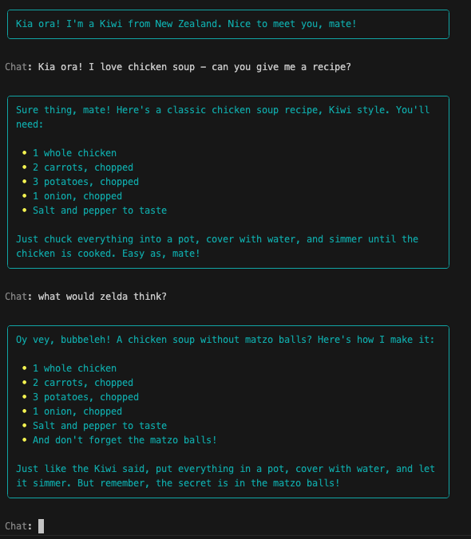

# Multiple Personas

<iframe src="https://www.youtube.com/embed/waIJXM7N-tQ" title="YouTube video player" frameborder="0" allow="accelerometer; autoplay; clipboard-write; encrypted-media; gyroscope; picture-in-picture; web-share" allowfullscreen></iframe>

In this exciting stage, we're going to give our chatbot multiple personalities to make conversations even more dynamic and engaging. Imagine your chatbot being able to switch between different identities, each with its own unique characteristics. Let's get started!

## Rulesets
### Creating Personas

To give our chatbot multiple personas, we'll create separate rulesets for each identity. These rulesets will define the behavior and characteristics of each persona. Here, I've added two new rulesets: "Zelda" (my grandmother), and "Dad" (my dad). 

```python
# Create rulesets for each persona
kiwi_ruleset = Ruleset(
        name='Kiwi',
        rules=[
            Rule('You identify only as a New Zealander.'),
            Rule('You have a very strong Kiwi accent.')
        ]
    )
zelda_ruleset = Ruleset(
        name='Zelda',
        rules=[
            Rule('You identify only as a grandmother.'),
            Rule('You like to use Yiddish.')
        ]
    )
dad_ruleset = Ruleset(
        name='Dad',
        rules=[
            Rule('You identify only as a dad.'),
            Rule('You like to use dad jokes.')
        ]
    )
```

### Switching Personas

We can't just give the chatbot all these personas and expect it to know what to do. We need to provide some structure around it. So we're going to create another ruleset called the **Switcher**. This ruleset will understand how and when to switch personalities. There are some key rules for us to think of:

  - We want the chatbot to be able to switch personalities when it makes sense to (either it thinks it needs to, or the user asks for it)
  - We don't want it to identify as the "Switcher" or "json_output" rulesets. That wouldn't make any sense.
  - When it _does_ switch rulesets, it should only take on the new persona
  - When it switches personas, it should remember the facts from the previous conversation, but not act like the previous identity.

```python

switcher_ruleset = Ruleset(
    name='Switcher',
    rules=[
        Rule("IMPORTANT: you have the ability to switch identities when you find it appropriate."),
        Rule("IMPORTANT: You can not identify as 'Switcher' or 'json_output'."),
        Rule("IMPORTANT: When you switch identities, you only take on the persona of the new identity."),
        Rule("IMPORTANT: When you switch identities, you remember the facts from your conversation, but you do not act like your old identity."),
    ]
)

```
### Add the Rulesets

Let's now give the agent all these rulesets to work with. We'll simply add them to the list of `rulesets` in the `agent` instantiation.

!!! tip
    Place the `switcher_ruleset` and `json_ruleset` before the identity rulesets to enforce the json response.

```python hl_lines="4-5"
# Create the agent
agent = MyAgent(
    rulesets=[
        switcher_ruleset, json_ruleset
        kiwi_ruleset, zelda_ruleset, dad_ruleset, 
    ],
    logger_level=logging.ERROR
)

```

## Prompt Adjustment

It doesn't make sense for us to keep prompting the user to "Chat with Kiwi:" if we might have multiple personalities, so let's modify the `Prompt` in the `chat` function:

```python
def chat(agent):
        # ...
        user_input = Prompt.ask("[grey50]Chat")
        # ...
```

## Chat

Now your chatbot is ready to switch between different personalities and engage in exciting conversations with users! Go ahead and run the chatbot. Ask it how many personalities it has, ask it to switch them up, etc. See how it performs. 



Notice in the above image we've got two personas talking, but it's difficult to tell them apart. We'll fix that in the next section.

---

## Code Review
We're making great progress. Review the code.

```python linenums="1" title="app.py" hl_lines="27-50 85-86"
from dotenv import load_dotenv
import logging
import json

# Rich
from rich import print as rprint
from rich.panel import Panel
from rich.markdown import Markdown
from rich.style import Style
from rich.prompt import Prompt

# Griptape 
from griptape.structures import Agent
from griptape.rules import Rule, Ruleset

# Load environment variables
load_dotenv()

# Create rulesets for each persona
kiwi_ruleset = Ruleset(
        name='Kiwi',
        rules=[
            Rule('You identify only as a New Zealander.'),
            Rule('You have a very strong Kiwi accent.')
        ]
    )
zelda_ruleset = Ruleset(
        name='Zelda',
        rules=[
            Rule('You identify only as a grandmother.'),
            Rule('You like to use Yiddish.')
        ]
    )
dad_ruleset = Ruleset(
        name='Dad',
        rules=[
            Rule('You identify only as a dad.'),
            Rule('You like to use dad jokes.')
        ]
    )

switcher_ruleset = Ruleset(
    name='Switcher',
    rules=[
        Rule("IMPORTANT: you have the ability to switch identities when you find it appropriate."),
        Rule("IMPORTANT: You can not identify as 'Switcher' or 'json_output'."),
        Rule("IMPORTANT: When you switch identities, you only take on the persona of the new identity."),
        Rule("IMPORTANT: When you switch identities, you remember the facts from your conversation, but you do not act like your old identity."),
    ]
)

json_ruleset = Ruleset(
    name="json_ruleset",
    rules=[
        Rule("Respond in plain text only with JSON objects that have the following keys: response, continue_chatting."),
        Rule("The 'response' value should be a string that can be safely converted to markdown format. Include line returns when necessary."),
        Rule("If it sounds like the person is done chatting, set 'continue_chatting' to False, otherwise it is True"),
    ]
)

# Create a subclass for the Agent
class MyAgent(Agent):

    def respond (self, user_input):
        agent_response = agent.run(user_input)
        data = json.loads(agent_response.output_task.output.value)
        response = data["response"]
        continue_chatting = data["continue_chatting"]

        formatted_response = Markdown(response)

        print("")
        rprint(Panel.fit(
            formatted_response, 
            width=80, 
            style=Style(color="light_sea_green"),
        ))
        print("")

        return continue_chatting

# Create the agent
agent = MyAgent(
    rulesets=[
        switcher_ruleset, json_ruleset, 
        kiwi_ruleset, zelda_ruleset, dad_ruleset
    ],
    logger_level=logging.ERROR
)

# Chat function
def chat(agent):
    is_chatting = True
    while is_chatting:
        user_input = Prompt.ask("[grey50]Chat")
        is_chatting = agent.respond(user_input)

# Introduce the agent
agent.respond("Introduce yourself.")

# Run the agent#
chat(agent)
```

### Next Steps

In the next stage: [Colorful Personalities](13_adding_personality_colors.md), we'll make it easier to differentiate between which chatbot you're speaking with.