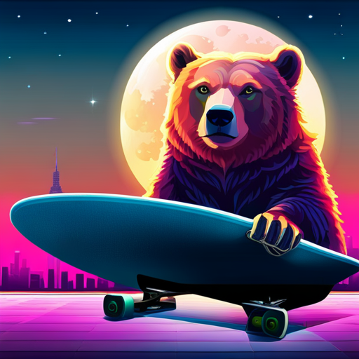
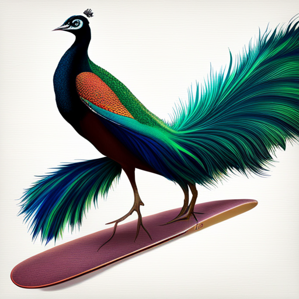
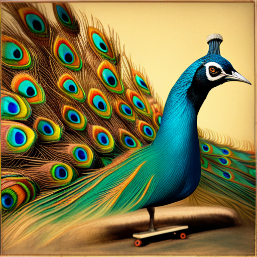
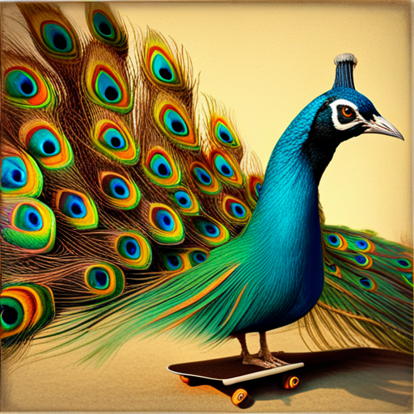

# Amazon Bedrock

## Overview

Amazon Bedrock offers a couple of different image generation models, and thus the method of using them is slightly different than DALL·E 3 and Leonardo.Ai.

Instead of just importing one driver, you import `AmazonBedrockImageGenerationDriver` and then the model driver: `AmazonBedrockStableDiffusionImageGenerationModelDriver` or `AmazonBedrockTitanImageGenerationModelDriver`.

We'll get into the specifics, but first it's important to ensure you have access to Amazon Bedrock, as it's a requirement to use either of these two models.

### AWS Access

* Ensure you have an AWS account
* Ensure you have access to the appropriate model by following the [Amazon Documentation](https://docs.aws.amazon.com/bedrock/latest/userguide/model-access.html){target="_blank"}
* Add the following environment variables to your `.env` file:
    * `AWS_REGION_NAME`
    * `AWS_ACCESS_KEY_ID`
    * `AWS_SECRET_ACCESS_KEY`

### boto3

You'll need to use `boto3` to access Amazon Bedrock. 

To install `boto3` by going to your terminal inside Visual Studio Code and:

* If using `pip`, type:
    ```bash
    pip install boto3
    ```
* If using `poetry` type:
    ```bash
    poetry add boto3
    ```

## Import

Let's import boto3, os, and all three drivers, and then we'll discuss their differences.

In your `app.py` imports section, add the three drivers:

```python
# ...

import boto3
import os

# ...

from griptape.drivers import (
    AmazonBedrockImageGenerationDriver,
    AmazonBedrockStableDiffusionImageGenerationModelDriver,
    AmazonBedrockTitanImageGenerationModelDriver
)

# ...

```

## Create a session

You will need a `boto3` session to pass to `AmazonBedrockImageGenerationDriver`. I recommend you create this after the `# Variables` section of your code:

```python
# ...

# Boto3
session = boto3.Session(
    region_name=os.getenv("AWS_REGION_NAME"),
    aws_access_key_id=os.getenv("AWS_ACCESS_KEY_ID"),
    aws_secret_access_key=os.getenv("AWS_SECRET_ACCESS_KEY"),
)

# ...
```

## Image Driver

To create the Image Driver, you're going to specify three attributes:

* `session` : This is the boto3 session you created earlier.
* `model` : This is the particular model you will be using. The list of models you have available to your account is in the AWS Console [here](https://us-east-1.console.aws.amazon.com/bedrock/modelaccess). Here are some examples you may have access to:
    * `amazon.titan-image-generator-v1`
    * `stability.stable-diffusion-xl-v0`
    !!! tip
        To get a list of all the models you have access to, you can add the following code after you defined `session`:
        ```python
        bedrock = session.client("bedrock")
        models = bedrock.list_foundation_models()
        for model in models["modelSummaries"]:
            if model["outputModalities"] == ["IMAGE"]:
                print(model["modelId"])    
        ```

        This will print a list of all models you should be able to use. 
* `image_generation_model_driver` : This is the specific Model Driver Class you imported above.

    !!! important
        You must specify the correct `model` for the `image_generation_model_driver` you're using. Specifying a `titan` model with `StableDiffusion` won't work.

### Attributes

Below is the full list of attributes available.

```yaml
model: Bedrock model ID.
session: boto3 session.
bedrock_client: Bedrock runtime client.
image_width: Width of output images. Defaults to 512 and must be a multiple of 64.
image_height: Height of output images. Defaults to 512 and must be a multiple of 64.
seed: Optionally provide a consistent seed to generation requests, increasing consistency in output.
image_generation_model_driver: Image Generation Model Driver to use.
```

## Stable Diffusion

Here's an example of a simple driver using Stable Diffusion. Notice the `model` and the `image_generation_model_driver` are both set.

```python hl_lines="3 4"
image_driver = AmazonBedrockImageGenerationDriver(
    session=session,
    model="stability.stable-diffusion-xl-v0",
    image_generation_model_driver=AmazonBedrockStableDiffusionImageGenerationModelDriver(),
)
```

There are a number of attributes available for Stable Diffusion. We'll cover details of a few key ones.

```yaml
cfg_scale: How strictly the diffusion process adheres to the prompt text (higher values keep your image closer to your prompt). The default is 7. 
style_preset: Pass in a style preset to guide the image model towards a particular style. 
clip_guidance_preset: CLIP Guidance is a technique that uses the CLIP neural network to guide the generation of images to be more in-line with your included prompt, which often results in improved coherency.
sampler: Which sampler to use for the diffusion process. If this value is omitted it automatically selects an appropriate sampler.
steps: The number of diffusion steps to run. The default is 30.
```

### style_preset

The `style_preset` is a fun one to work with. Instead of modifying the prompt, you can try various styles. Here are some variations of `bear on a skateboard` - still with the 1970s polaroid theme, but passing different `style presets`. 

In order they're: `line-art`, `neon-punk`, `photographic`.

<div class="grid-gallery grid-3" markdown>
- 
- 
- 

</div>

```python hl_lines="5"
image_driver = AmazonBedrockImageGenerationDriver(
    session=session,
    model="stability.stable-diffusion-xl-v0",
    image_generation_model_driver=AmazonBedrockStableDiffusionImageGenerationModelDriver(
        style_preset="neon-punk",
    ),
)

```

The full options available are: `3d-model` `analog-film` `anime` `cinematic` `comic-book` `digital-art` `enhance` `fantasy-art` `isometric` `line-art` `low-poly` `modeling-compound` `neon-punk` `origami` `photographic` `pixel-art` `tile-texture`

### Sampler

Which sampler to use for the diffusion process. The default is `K_DPMPP_2M`. This can be quite confusing, so there's a helpful guide here about which samplers to use: [https://stable-diffusion-art.com/samplers/](https://stable-diffusion-art.com/samplers/){target="_blank"}.

```python hl_lines="5"
image_driver = AmazonBedrockImageGenerationDriver(
    session=session,
    model="stability.stable-diffusion-xl-v0",
    image_generation_model_driver=AmazonBedrockStableDiffusionImageGenerationModelDriver(
        sampler="K_DPM_2",
    ),
)
```

The options available are: `DDIM` `DDPM` `K_DPMPP_2M` `K_DPMPP_2S_ANCESTRAL` `K_DPM_2` `K_DPM_2_ANCESTRAL` `K_EULER` `K_EULER_ANCESTRAL` `K_HEUN` `K_LMS`

### CLIP guidance

The `clip_guidance_preset` uses a neural network to guide the generation of images. You can see more information about it in the [Stable Diffusion documentation](https://platform.stability.ai/docs/features/clip-guidance){target="_blank"}.

CLIP guidance only works when using an ANCESTRAL sampler.

```python hl_lines="5"
image_driver = AmazonBedrockImageGenerationDriver(
    session=session,
    model="stability.stable-diffusion-xl-v0",
    image_generation_model_driver=AmazonBedrockStableDiffusionImageGenerationModelDriver(
        clip_guidance_preset="SLOWEST",
    ),
)
```
The full options available are: `FAST_BLUE` `FAST_GREEN` `NONE` `SIMPLE` `SLOW` `SLOWER` `SLOWEST`.

Try out different options to see what works best for your use case. Here are three examples using `NONE`, `FAST_BLUE`, and `SLOWEST`.

<div class="grid-gallery grid-3" markdown>
- 
- 
- 

</div>


## Bedrock Titan


## Next Step
You now have a working pipeline for creating and displaying an image. Now we'll start taking a look at some of the options available to us with each of the Image Generation Drivers available in Griptape. 