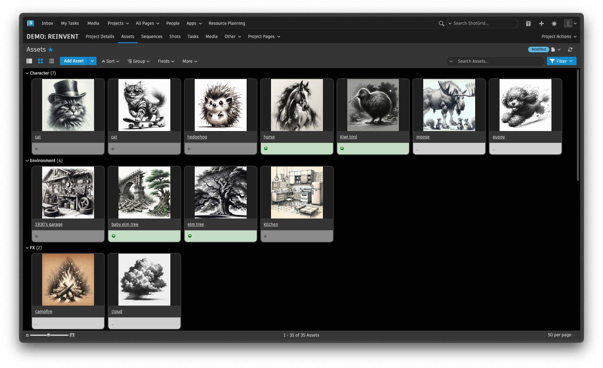

# Griptape and ShotGrid: A Practical Approach to Tool Integration

## Course Description
This course offers a friendly and accessible path to understand how [Griptape Tools](https://docs.griptape.ai/latest/griptape-tools/), functioning as specialized Python classes, enable Language Learning Models (LLMs) to interface with external APIs and datasets, thus broadening their operational scope.

At the end of this course, you will have working Python code for a Griptape Tool that enables a Griptape Agent to invoke capabilities from [Autodesk](https://www.shotgridsoftware.com/) ShotGrid](https://www.shotgridsoftware.com/). Imagine commanding the chatbot to "Create 20 assets for a 1950's kitchen counter, give them relevant descriptions, and set up initial task dependencies." This scenario encapsulates the kind of interactive and practical tasks you will be able to accomplish. 

## What is ShotGrid?
ShotGrid is Autodesk's production management software. It is used mainly to manage Media and Entertainment (Games, Film, Commercials, etc) productions. You can track deadlines, manage budgets, create and manage asset development, collaborate with others, and more. 

It's got a rich Python API, which many studios have used to integrate with various software tools like [Autodesk Maya](https://www.autodesk.com/za/products/maya/overview-dts), [SideFX Houdini](https://www.sidefx.com/products/houdini/), [Foundry Nuke](https://www.foundry.com/products/nuke-family/nuke), and many others.

## Who is this course for
This course is specifically designed for a diverse group of learners.

* **Intermediate-Level Python Developers**: If you have a solid grounding in Python and are looking to broaden your skill set, this course will introduce you to the exciting world of Griptape Tools. It's perfect for those who want to learn how to develop and implement these tools in various contexts, adding a valuable dimension to their programming expertise.

* **Pipeline Technical Directors in the Entertainment Industry**: For professionals involved in managing and optimizing content creation pipelines, this course offers insights into integrating LLMs into existing workflows. Whether you're working in film, animation, or gaming, the skills learned here will empower you to leverage LLMs for enhanced efficiency and innovation in your projects.

* **Tool Makers and Developers**: If you're in the business of creating tools and applications, this course will show you how to integrate LLMs using Griptape. It's an opportunity to see how LLMs can add advanced capabilities to your products, making them more dynamic and intelligent.

## Prerequisites
Before beginning this course, you will need:

- An OpenAI API Key (available here: https://beta.openai.com/account/api-keys)
- Python3.9+ installed on your machine
- An IDE (such as Visual Studio Code or PyCharm) to write and manage your code

If you don't have those items available, it's highly recommended you go through the [Griptape Setup - Visual Studio Code](../../setup/index.md) course to set up your environment.

!!! note 
    If you don't currently have an Autodesk ShotGrid subscription, that's okay. We'll take you through the process of signing up for a **free trial** in the [second module](02_shotgrid.md).

## Course Outline
The course will cover:

* Signing up for Autodesk ShotGrid
* Using Griptape Tools
* Creating your first tool
* Extending your tool with different activities
* Creating your first ShotGrid client tool
* Using the tool with an Agent
* Directing the interaction with Rules and Rulesets
* Giving the Agent access to ShotGrid API docs for improved results

## Useful Resources and Links

- [Griptape Documentation](https://github.com/griptape-ai/griptape)
- [Visual Studio Code](https://code.visualstudio.com/)
- [Jinja2 Documentation](https://jinja.palletsprojects.com/en/3.1.x/)
- [Autodesk ShotGrid](https://www.shotgridsoftware.com/)
- [Autodesk Shotgrid Python API](https://developers.shotgridsoftware.com/python-api/)

---
## Next Steps

Get yourself all set up and ready by moving on to [Setup](01_setup.md).

